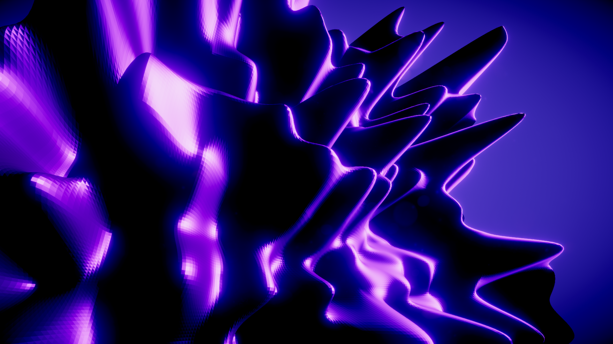

# ProceduralMeshGeneration

This is a demo project which shows how to create and render procedural geometry in Unity, utilizing Compute Shaders.

I built this project in Unity 2018.4, using built-in render pipeline. This should work fine on 2019, too.
Slightly different method need to be used if rendering is intended to happen with HDRP.

## Setup

This is a full project, so it should function after downloading and installing the packages used.

## Process

This a short overview of how the mesh generation works:

- A compute shader is set up in C#
    - Buffers are initialized and set to the compute shader, these will contain the positions and normals.
    - Variables are set to the compute shader (time, noise scale etc.)
- The mesh data is dynamically generated in a Compute Shader
- The mesh data is stored to structured buffers
- The buffers are assigned to a vert/frag shader in a material (this will be used for rendering)
- Graphics.DrawProceduralIndirect is used to actually render the mesh
- Lighting and shading is built in the shader, as the rendered mesh doesn't actually interact with rendered lighting

I've left in quite a few comments to illuminate what's happening.

This effect prototype reallocates it's resources when the grid size changes, so it can be done runtime.

## Notes

SV_VertexID contains vertex index number, used with compute shaders. See manual: https://docs.unity3d.com/Manual/SL-ShaderSemantics.html.

It seems that OnPostRender() is broken (or I couldn't get it to work.) No matter if the script as assigned to camera, the mesh didn't render. Luckily OnRenderObject() seems to work and it does not need to be attached to the camera.

I built a bilinear interpolated noise deformer to the demo.
